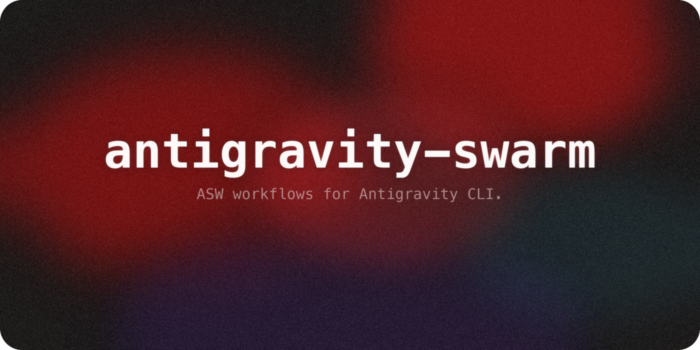

<p align="center">
  
</p>

# Antigravity Sub-Agents Skill 🚀

**Hire a team of AI agents to code for you.**

This skill allows you to spawn multiple specialized AI agents (Sub-Agents) to work on complex tasks in parallel. Whether you are using the terminal or the Antigravity IDE, this tool orchestrates a team of experts—Architects, Engineers, and Validators—to solve your problems efficiently.

```text
┏━━━━━━━━━━━━━━━━━━━━━━━━━━━━━━━━━━━━━━━━━━━━━━━━━━━━━━━━━━━━━━━━━━━━━━━━━━━━━━┓
┃                   ✨ Antigravity Swarm Mission Control ✨                      ┃
┗━━━━━━━━━━━━━━━━━━━━━━━━━━━━━━━━━━━━━━━━━━━━━━━━━━━━━━━━━━━━━━━━━━━━━━━━━━━━━━┛
┌──────────────┬──────────┬──────────────┬───────┬─────────┬─────────────────────┐
│ Agent        │ Role     │ Status       │ Time  │ Msgs    │ Backend             │
├──────────────┼──────────┼──────────────┼───────┼─────────┼─────────────────────┤
│ ● Oracle     │ parallel │ ⠋ Running    │ 12.3s │ ↑2 ↓1   │ tmux %3             │
│ ● Junior     │ parallel │ ⠋ Running    │ 10.1s │ ↑0 ↓1   │ tmux %4             │
│ ● Librarian  │ serial   │ • Pending    │ -     │ -       │ -                   │
│ ● Validator  │ validator│ • Pending    │ -     │ -       │ -                   │
└──────────────┴──────────┴──────────────┴───────┴─────────┴─────────────────────┘
┌─── Live Activity ──────────────────────────────────────────────────────────────┐
│ Oracle: Analyzing auth.py module structure...                                  │
└────────────────────────────────────────────────────────────────────────────────┘
[Tab] View  [w,s] Select  [k] Kill  [s] Shutdown  [q] Quit
```

> [!IMPORTANT] 
> **Why do you need this?**
>
> As of 2026-03-02, **there is NO native method** to deploy sub-agents in Gemini CLI or the Antigravity IDE.
> This skill bridges that gap, unlocking true parallel agent orchestration for your environment.

> [!NOTE]
> **Windows Compatibility**
>
> This skill includes native support for Windows environments:
> - **UTF-8 I/O**: PowerShell environments (CP949/Korean locale) enforce UTF-8 encoding for all I/O operations.
> - **TUI Keyboard Input**: The orchestrator dashboard uses `msvcrt` for native Windows keyboard handling (arrow keys, Tab, Enter, ESC, q). Falls back to `termios`/`tty` on macOS/Linux automatically.
>   *(Added in [PR #2](https://github.com/wjgoarxiv/antigravity-swarm/pull/2) by [@olveirap](https://github.com/olveirap))*

> [!WARNING]
> **Do NOT modify files in this directory while the Orchestrator is running.**
> The system actively reads and writes to `task_plan.md`, `findings.md`, and files in the `.swarm/` directory.
> Manual edits during execution may cause race conditions or inconsistent agent behavior.

> [!NOTE]
> **State Files Management**
> When you initiate a major mission, the system will automatically generate `task_plan.md`, `findings.md`, and `progress.md` in your project root, plus a `.swarm/` directory for runtime state.
> These files serve as the "shared memory" for the agent swarm. Do not delete them while a mission is active.

---

## What's New in v2

Antigravity Swarm has evolved from a batch orchestrator to a **live agent team platform**:

- **Inter-Agent Messaging**: Agents can communicate via a file-based JSON mailbox system with `<<SEND_MESSAGE>>` and `<<BROADCAST>>` tags
- **Agent Lifecycle Management**: PENDING → RUNNING → IDLE → poll → RUNNING → COMPLETED/FAILED/SHUTDOWN
- **Interactive TUI v2**: Three views (Dashboard with 6 columns, Messages timeline, Agent Detail) with full keyboard navigation
- **Backend Abstraction**: Thread backend (default) + tmux split-pane backend (auto-selected if tmux available)
- **Audit Trail**: Append-only JSONL per mission in `.swarm/audit/`
- **Mission Persistence**: Resume interrupted missions with `--resume`
- **Team Presets**: `swarm-config.yaml` with reusable team configurations via `--preset` flag
- **Post-Mission Reporting**: Auto-generated summary with per-agent statistics
- **Streaming Side-Effect Parsing**: Tags executed as they appear (not after completion)
- **Heartbeat Monitoring**: Automatic dead agent detection

---

## Why use this?

- **Parallel Execution**: Why wait for one agent to finish? Run 3 agents at once (e.g., one writes docs, one writes tests, one writes code).
- **Specialization**: Assign different "Personas" (Prompts) to each agent.
- **Inter-Agent Communication**: Agents can message each other to coordinate, share findings, or request help.
- **Quality Assurance**: Every team includes a mandatory **Validator Agent** who reviews the work before completion, ensuring high quality.
- **Resume Support**: Interrupted missions can be resumed from the last checkpoint.

---

## Prerequisites

Before installing, ensure you have the following:

| Requirement | Install Command | Notes |
|------------|----------------|-------|
| **Node.js** (v18+) | [nodejs.org](https://nodejs.org) | Required for Gemini CLI |
| **Gemini CLI** | `npm install -g @google/gemini-cli` | Core dependency — agents run on Gemini |
| **Python 3.8+** | [python.org](https://python.org) | Runtime for orchestrator scripts |
| **pip packages** | `pip install -r requirements.txt` | `rich`, `pyyaml` |

> [!TIP]
> If Gemini CLI is not installed, the planner will offer to install it automatically when you first run a mission.

---

## Installation

> [!TIP]
> You can paste the following block directly to an LLM agent and let it perform installation end-to-end.

```text
Install this repository end-to-end with verification.

Repository: https://github.com/wjgoarxiv/antigravity-swarm
Target directory: <your-install-path>/antigravity-swarm

Do this exactly:
1) Clone the repo into the target directory (if already exists, do not reset/delete; report current state).
2) Install dependencies from requirements.txt.
3) Verify runtime prerequisites and build health:
   - gemini --version
   - python3 -m py_compile scripts/*.py scripts/core/*.py scripts/core/backends/*.py
   - python3 scripts/orchestrator.py --demo
4) If this repository contains nvim/neovim setup files, apply those settings too; if not, report "no nvim config found" and continue.

Safety rules:
- Stop immediately on first failure and report exact failed command + reason.
- Never run destructive git commands (reset --hard, force push, checkout --, delete existing dirs).

Final report format:
- Cloned: yes/no
- Dependencies: yes/no
- Validation: pass/fail
- Nvim setup: applied/skipped
- Next action: one line
```

1.  **Locate the Skill**: Ensure this repository is in your skills folder:
    ```bash
    ~/.gemini/skills/antigravity-swarm/
    ```
2.  **Install Dependencies**:

    ```bash
    pip install -r requirements.txt
    ```

    _(Requires `rich`, `pyyaml`, etc.)_

3.  **Gemini CLI**: Ensure the `gemini` command is installed and in your PATH.

4.  **Configuration (Optional)**: Create `swarm-config.yaml` in the project root to define team presets and customize behavior.

### Agent One-Shot Prompt (Update/Upgrade)

```text
Update this repository safely and re-validate without reinstalling from scratch.

Repository path: <your-install-path>/antigravity-swarm

Do this exactly:
1) Check current git status and branch.
2) Pull latest changes safely (no destructive operations).
3) Reinstall/refresh Python dependencies only if requirements.txt changed.
4) Run validation:
   - gemini --version
   - python3 -m py_compile scripts/*.py scripts/core/*.py scripts/core/backends/*.py
   - python3 scripts/orchestrator.py --demo
5) If nvim/neovim config files exist in this repo and changed, apply/update them; otherwise report "no nvim update needed".

Safety rules:
- Never run destructive git commands (reset --hard, clean -fd, force push, checkout --).
- If merge/rebase conflicts happen, stop and report files with conflicts.

Final report format:
- Pulled: yes/no
- Dependency refresh: yes/no
- Validation: pass/fail
- Nvim update: applied/skipped
- Next action: one line
```

---

## User Manual

Use one of these minimal paths.

### Path A: Gemini CLI (Recommended)

```bash
python3 scripts/planner.py --preset quick "Your mission"
python3 scripts/orchestrator.py --yes
```

Resume:

```bash
python3 scripts/orchestrator.py --resume
```

Demo (no Gemini required):

```bash
python3 scripts/orchestrator.py --demo
```

### Path B: Autonomous Loop

```bash
python3 scripts/ultrawork_loop.py "Your mission"
```

Resume:

```bash
python3 scripts/ultrawork_loop.py --resume
```

### Path C: Antigravity IDE

Add this skill to `~/.gemini/GEMINI.md` and the main agent can trigger it automatically for complex tasks.

---

## Example Prompts

Not sure how to start? Copy-paste one of these prompts to your LLM agent:

### Basic Usage

```text
antigravity-swarm 스킬을 이용해서 이 프로젝트에 대한 단위 테스트를 작성해줘.
```

```text
Use the antigravity-swarm skill to refactor the authentication module in this project.
```

### Advanced Usage

```text
antigravity-swarm 스킬의 fullstack 프리셋을 이용해서 React 기반의 Todo 앱을 만들어줘.
```

```text
Use the antigravity-swarm skill with the research preset to analyze the codebase architecture and generate documentation.
```

### Direct CLI Usage

```bash
# Quick mission with preset
python3 scripts/planner.py --preset quick "Write unit tests for all Python modules"
python3 scripts/orchestrator.py --yes

# Full-stack team for a complex task
python3 scripts/planner.py --preset fullstack "Build a REST API with authentication"
python3 scripts/orchestrator.py --yes
```

> [!TIP]
> When using from an IDE agent, simply describe your task in natural language with "antigravity-swarm 스킬을 이용해서" (Korean) or "Use the antigravity-swarm skill to" (English) as a prefix.

---

## Available Agent Roles (Oh-My-Opencode Standard)

The Planner automatically selects the best experts for your mission from this pool:

| Role | Expertise | Model |
|------|-----------|-------|
| **Oracle** | Architecture, Deep Debugging, Root Cause Analysis | gemini-3-pro |
| **Librarian** | Documentation, Code Structure, Research | gemini-3-flash |
| **Explore** | Fast Search, Pattern Matching, Reconnaissance | gemini-3-flash |
| **Frontend** | UI/UX, Styling, Accessibility | gemini-3-flash |
| **Multimodal** | Vision Analysis, Mockups | gemini-3-pro |
| **Doc_Writer** | READMEs, API Docs, Comments | gemini-3-flash |
| **Prometheus** | Strategic Planning, Requirements Gathering | gemini-3-pro |
| **Momus** | Critical Review, Risk Identification | gemini-3-pro |
| **Sisyphus** | Task Coordination, Delegation (PM) | gemini-3-flash |
| **Junior** | Implementation, Coding, Bug Fixing | gemini-3-flash |
| **Quality_Validator** | Final Verification & Testing (Mandatory) | gemini-3-flash |

---

## Configuration

Create `swarm-config.yaml` in your project root to customize behavior and define team presets:

```yaml
# Team presets (reusable configurations)
presets:
  fullstack:
    agents:
      - name: Frontend
        role: parallel
      - name: Junior
        role: parallel
      - name: Quality_Validator
        role: validator

  research:
    agents:
      - name: Librarian
        role: serial
      - name: Explore
        role: parallel
      - name: Quality_Validator
        role: validator

# Global settings
orchestrator:
  max_parallel: 3
  heartbeat_interval: 30
  backend: auto  # 'thread', 'tmux', or 'auto'
```

Use a preset:

```bash
python3 scripts/planner.py --preset fullstack "Your mission description"
```

---

## Agent Communication

Agents can communicate with each other using two special tags:

### Send Direct Message

```markdown
<<SEND_MESSAGE>>
to: Junior
subject: Authentication module structure
---
I've analyzed the codebase. The auth module is in `src/auth/`.
Please implement OAuth2 flows in `src/auth/oauth.py`.
<<END_SEND_MESSAGE>>
```

### Broadcast to All Agents

```markdown
<<BROADCAST>>
subject: API contract finalized
---
The REST API spec is now frozen. See `docs/api.yml` for details.
All agents should follow this contract.
<<END_BROADCAST>>
```

Messages are delivered via a file-based JSON mailbox system in `.swarm/mailboxes/`. The orchestrator displays message activity in real-time.

---

## TUI Controls

The Interactive TUI v2 supports three views with keyboard navigation:

| Key | Action |
|-----|--------|
| **Tab** | Cycle between Dashboard, Messages, and Agent Detail views |
| **w / s** | Navigate agent list or messages |
| **Enter** | View detailed information for selected agent/message |
| **k** | Kill selected agent (SIGTERM) |
| **s** | Send shutdown request to selected agent |
| **q** | Quit orchestrator |
| **Esc** | Return to Dashboard view |
| **?** | Show help overlay |

### Dashboard View (6 Columns)

- **Agent**: Agent name with status indicator
- **Role**: parallel / serial / validator
- **Status**: Pending / Running / Idle / Completed / Failed / Shutdown
- **Time**: Runtime duration
- **Msgs**: Message counts (↑ sent, ↓ received)
- **Backend**: Execution backend (thread ID or tmux pane)

### Messages View

Real-time message timeline showing all inter-agent communication with timestamps and subjects.

### Agent Detail View

Detailed status for a single agent including full conversation history, message inbox, and resource usage.

---

## Protocol & Architecture

### The "Manus Protocol"

This skill enforces a rigorous state management protocol:

- **`task_plan.md`**: The master checklist.
- **`findings.md`**: Shared scratchpad for agents to exchange knowledge.
- **`progress.md`**: Immutable log of what has been done.

### Inter-Agent Mailbox System

In addition to the Manus Protocol files, v2 introduces a file-based JSON mailbox system:

- **`.swarm/mailboxes/{agent}/inbox/`**: Unread messages for each agent
- **`.swarm/mailboxes/{agent}/processed/`**: Archive of read messages
- **Message Format**: JSON files with `from`, `to`, `subject`, `body`, `timestamp` fields
- **Delivery**: Orchestrator polls mailboxes and injects messages into agent prompts

This allows agents to collaborate dynamically without modifying shared markdown files.

### The "Validator" Rule

By design, the **final agent** in any generated team is strictly enforced to be a **Quality Validator**.

- **Role**: Reviewer / QA.
- **Task**: Check if `task_plan.md` is complete, run tests, and ensure the user's requirements are met.
- **Benefit**: Redundant self-correction loop.

### Agent Lifecycle

Agents transition through these states:

1. **PENDING**: Agent hired but not yet started
2. **RUNNING**: Agent actively processing a task
3. **IDLE**: Agent waiting for more work (can receive messages)
4. **COMPLETED**: Agent finished successfully
5. **FAILED**: Agent encountered a fatal error
6. **SHUTDOWN**: Agent received shutdown request and exited gracefully

The orchestrator monitors heartbeats and automatically detects dead agents.

### Backend Abstraction

Two execution backends are supported:

- **Thread Backend**: Default. Each agent runs in a Python thread. Portable but no visual separation.
- **Tmux Backend**: Auto-selected if tmux is available. Each agent runs in a tmux split-pane for live monitoring.

Backend selection is automatic (`auto` mode) or can be forced via `swarm-config.yaml`.

---

## Directory Structure

```text
antigravity-swarm/
├── scripts/
│   ├── core/                    # Shared core package
│   │   ├── __init__.py
│   │   ├── config.py            # Centralized config + get_gemini_path()
│   │   ├── types.py             # AgentStatus, MessageType, AgentIdentity
│   │   ├── mailbox.py           # File-based JSON mailbox system
│   │   ├── audit.py             # Append-only JSONL audit trail
│   │   ├── mission.py           # Mission state persistence
│   │   └── backends/
│   │       ├── __init__.py      # get_backend() factory
│   │       ├── base.py          # SpawnBackend ABC
│   │       ├── thread_backend.py
│   │       └── tmux_backend.py
│   ├── planner.py               # Team hiring + presets + team config
│   ├── orchestrator.py          # Interactive TUI v2 + backends + mailbox
│   ├── dispatch_agent.py        # Agent lifecycle + streaming parse + messaging
│   ├── ultrawork_loop.py        # Autonomous loop + resume support
│   ├── compactor.py             # Context compaction
│   └── reporter.py              # Post-mission summary report
├── swarm-config.yaml            # User configuration + presets
├── subagents.yaml               # Current team roster (auto-generated)
├── task_plan.md                 # Current mission status
├── SKILL.md                     # Skill metadata
├── README.md                    # This file
└── README_KO.md                 # Korean documentation
```

### Runtime Directory (.swarm/)

```text
.swarm/
├── config.json                  # Team roster (auto-generated)
├── mailboxes/
│   ├── oracle/
│   │   ├── inbox/               # Unread messages
│   │   └── processed/           # Read messages
│   └── junior/
│       ├── inbox/
│       └── processed/
├── audit/
│   └── mission-xyz.jsonl        # Append-only audit trail
└── missions/
    └── mission-xyz.json         # Mission state for resume
```

---

## ⭐️ Credits & Inspiration

This project is heavily inspired by **[Oh-My-Opencode](https://github.com/code-yeongyu/oh-my-opencode)**.

We have adopted its core philosophies:
- **Multi-Agent Orchestration**: Using specialized roles (Oracle, Librarian, Sisyphus) for distinct tasks.
- **The "Manus Protocol"**: Using persistent markdown files (`task_plan.md`, `findings.md`) for state management. This pattern is heavily inspired by **[planning-with-files](https://github.com/OthmanAdi/planning-with-files)**.
- **Ultrawork Loop**: The autonomous "Plan -> Act -> Verify" cycle.

Huge thanks to the original creators for defining these agent interaction patterns.
